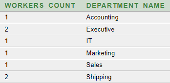
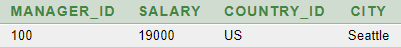

## Отделы и сколько разных сотрудников в каждом отделе уволено. Вывод в алфавитном порядке по названию отделa
```sql
SELECT 
    count(distinct job.EMPLOYEE_ID) AS workers_count, 
    dep.DEPARTMENT_NAME
FROM JOB_HISTORY job
JOIN DEPARTMENTS dep ON job.DEPARTMENT_ID=dep.DEPARTMENT_ID
GROUP BY dep.DEPARTMENT_NAME
HAVING count(distinct job.EMPLOYEE_ID) >= 1
ORDER BY dep.DEPARTMENT_NAME
```


## Вывод страны и города самого высокооплачиваемого менедждера

```sql
SELECT *
FROM
(
    SELECT 
        dep.manager_id, 
        emp.salary
    FROM departments dep
    LEFT JOIN employees emp ON dep.manager_id=emp.employee_id
    WHERE 
        emp.salary=
        (
            SELECT max(salary)
            FROM employees
            WHERE employee_id IN 
            (
                SELECT manager_id
                FROM departments
            )
        )
)
JOIN 
(
    SELECT 
        dep.manager_id, 
        loc.country_id, 
        loc.city
    FROM departments dep
    LEFT JOIN locations loc ON loc.location_id=dep.location_id
    WHERE dep.manager_id IS NOT NULL
)
USING(manager_id)
```
