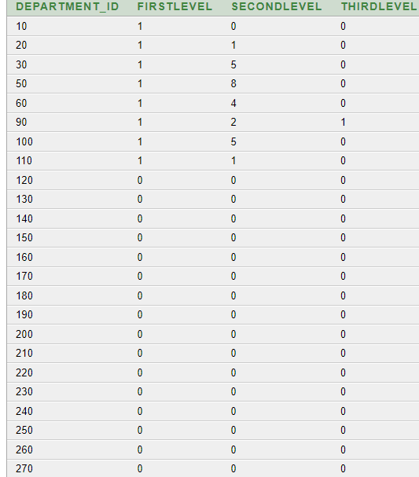

# 1. Basic queries
## Отделы и сколько разных сотрудников в каждом отделе уволено. Вывод в алфавитном порядке по названию отделa
```sql
SELECT 
    count(distinct job.EMPLOYEE_ID) AS workers_count, 
    dep.DEPARTMENT_NAME
FROM JOB_HISTORY job
JOIN DEPARTMENTS dep ON job.DEPARTMENT_ID=dep.DEPARTMENT_ID
GROUP BY dep.DEPARTMENT_NAME
HAVING count(distinct job.EMPLOYEE_ID) >= 1
ORDER BY dep.DEPARTMENT_NAME
```


## Вывод страны и города самого высокооплачиваемого менедждера

```sql
SELECT *
FROM
(
    SELECT 
        dep.manager_id, 
        emp.salary
    FROM departments dep
    LEFT JOIN employees emp ON dep.manager_id=emp.employee_id
    WHERE 
        emp.salary=
        (
            SELECT max(salary)
            FROM employees
            WHERE employee_id IN 
            (
                SELECT manager_id
                FROM departments
            )
        )
)
JOIN 
(
    SELECT 
        dep.manager_id, 
        loc.country_id, 
        loc.city
    FROM departments dep
    LEFT JOIN locations loc ON loc.location_id=dep.location_id
    WHERE dep.manager_id IS NOT NULL
)
USING(manager_id)
```


# 2. Window Functions
## Определить год, в котором было трудоустроено больше всего человек

```sql
SELECT
startYear
FROM
(
    SELECT
        COUNT(employee_id) AS newWorkers,
        EXTRACT(YEAR FROM start_date) AS startYear,
        DENSE_RANK() over (order by COUNT(distinct employee_id) desc) AS dense_rank
    FROM job_history
    GROUP BY EXTRACT(YEAR FROM start_date)
)
WHERE dense_rank=1
ORDER BY dense_rank
```

## Выбрать среди работников Америки (region_name = 'Americas') тех, чья зарплата превосходит зарплату менеджера из Европы (region_name = 'Europe') с наибольшим количеством подчиненных.

```sql
WITH americanWorkers AS
(
    SELECT 
        last_name, 
        first_name, 
        country_id, 
        salary, 
        manager_id
    FROM regions
        JOIN countries USING(region_id)
        JOIN locations USING(country_id)
        JOIN departments USING(location_id)
        JOIN employees USING(department_id)
    WHERE (region_name='Americas')
),
managerss AS 
(
    SELECT 
        COUNT(employee_id), 
        manager_id,
        DENSE_RANK() OVER (ORDER BY COUNT(employee_id) DESC) AS rank
    FROM regions
        JOIN countries USING(region_id)
        JOIN locations USING(country_id)
        JOIN departments USING(location_id)
        JOIN employees USING(department_id)
    WHERE (region_name='Europe')
    GROUP BY manager_id
),
managerSalary  AS
(
    SELECT MAX(emp.salary) AS maxSalary
    FROM managerss mngs
    JOIN employees emp ON mngs.manager_id=emp.employee_id
    WHERE mngs.rank=1
)

SELECT 
    amWrks.last_name, 
    amWrks.first_name, 
    amWrks.salary
FROM americanWorkers amWrks, managerSalary
WHERE amWrks.salary >= managerSalary.maxSalary
```


## Вывести для каждого отдела из Америки (region_name = Americas) количество работников в иерархии до третьего уровня. Первый уровень - работники без руководителя, второй уровень - это их подчиненные, а третий уровень - подчиненные работников второго уровня.

```sql
with deps as (
select department_id, manager_id
from regions 
join countries using(region_id)
join locations using(country_id)
join departments using(location_id)
where region_name='Americas'
order by department_id
),
firstLevel as (
select 
department_id,
manager_id as employee_id
from deps
order by department_id
),
secondLevel as (
select
emp.employee_id,
fl.employee_id as manager_id,
fl.department_id
from firstLevel fl
join employees emp on fl.employee_id=emp.manager_id and fl.department_id=emp.department_id
order by fl.department_id
),
thirdLevel as (
select
emp.employee_id,
sl.employee_id as manager_id,
sl.department_id
from secondLevel sl
join employees emp on sl.employee_id=emp.manager_id and sl.department_id=emp.department_id
order by sl.department_id
),
firstLevelCount as (
select 
fl.department_id,
count(fl.employee_id) as FirstLevel
from firstLevel fl
group by fl.department_id
order by fl.department_id
),
secondLevelCount as (
select 
department_id,
count(employee_id) as SecondLevel
from secondLevel
group by department_id
order by department_id
),
thirdLevelCount as (
select 
department_id,
count(employee_id) as ThirdLevel
from thirdLevel
group by department_id
order by department_id
)

select department_id, nvl(firstLevelCount.FirstLevel, 0) as FirstLevel, nvl(SecondLevelCount.SecondLevel, 0) as SecondLevel, nvl(ThirdLevelCount.ThirdLevel, 0) as ThirdLevel
from deps
left join firstLevelCount using(department_id)
left join secondLevelCount using(department_id)
left join thirdLevelCount using(department_id)
order by department_id
```
