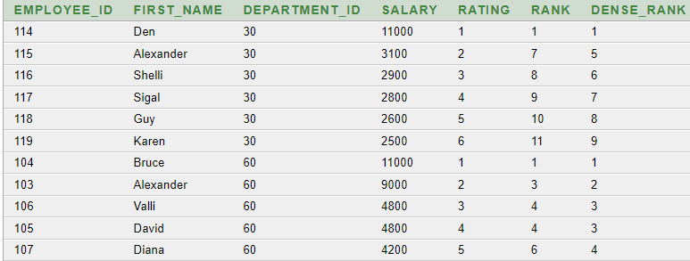
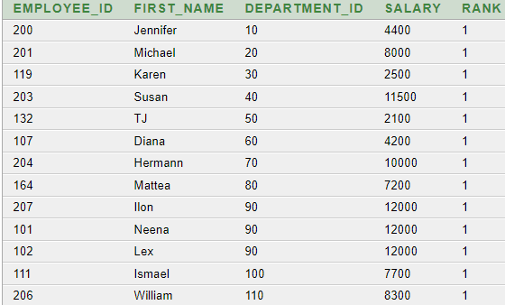

# Ранжирующие оконные функции
```SQL
SELECT 
    EMPLOYEE_ID,
    FIRST_NAME,
    DEPARTMENT_ID,
    SALARY,
    row_number() OVER (PARTITION BY DEPARTMENT_ID ORDER BY SALARY DESC) AS RATING,
    RANK() OVER (ORDER BY SALARY DESC) AS RANK,
    DENSE_RANK() OVER (ORDER BY SALARY DESC) AS DENSE_RANK
FROM EMPLOYEES
WHERE DEPARTMENT_ID IN (60, 30)
ORDER BY DEPARTMENT_ID
```


- ```PARTITION``` - группировка по ...
- ```RANK``` - ранжировка по полю, но при одинаковых значениях выкидывает числа( т.е. будет: 1,2,3,3,5,6...)
- ```DENSE_RANK``` - как RANK, но без особенности


# Примеры

### 1. Поиск сотрудников с минимальной зарплатой по отделам, Department!=NULL

#### 1.1 С помощью ранга
```sql
SELECT *
FROM
(
SELECT 
    EMPLOYEE_ID,
    FIRST_NAME,
    department_id,
    SALARY,
    rank() OVER (PARTITION BY department_id ORDER BY salary) AS rank
FROM EMPLOYEES
WHERE department_id IS NOT NULL
)
WHERE rank=1
```

#### 1.2 Функцией min()
```sql
SELECT *
FROM
(
    SELECT 
        EMPLOYEE_ID,
        FIRST_NAME,
        DEPARTMENT_ID,
        SALARY,
        min(salary) OVER (PARTITION BY DEPARTMENT_ID) AS dep_min_salary
    FROM EMPLOYEES
    where DEPARTMENT_ID IS NOT NULL
)
WHERE SALARY=dep_min_salary
ORDER BY SALARY
```

#### 1.3 Без оконных функций
```sql
SELECT 
    EMPLOYEE_ID,
    FIRST_NAME,
    DEPARTMENT_ID,
    SALARY
FROM EMPLOYEES
WHERE (SALARY, DEPARTMENT_ID) IN
(
    SELECT 
        MIN(SALARY) AS min_sal, 
        DEPARTMENT_ID
    FROM EMPLOYEES
    GROUP BY DEPARTMENT_ID
)
ORDER BY DEPARTMENT_ID
```



