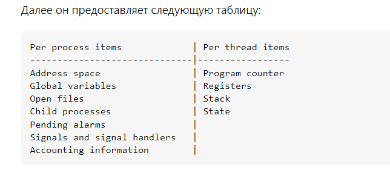

## THREADS

создание потока сводится к этим командам:

* rt_sigaction(SIGRT_1, {sa_handler=0x7fd390dd1520, sa_mask=[], sa_flags=SA_RESTORER|SA_ONSTACK|SA_RESTART|SA_SIGINFO,sa_restorer=0x7fd390d7d320}, NULL, 8) = 0
* rt_sigprocmask(SIG_UNBLOCK, [RTMIN RT_1], NULL, 8) = 0
* mmap(NULL, 8392704, PROT_NONE, MAP_PRIVATE|MAP_ANONYMOUS|MAP_STACK, -1, 0) = 0x7fd390534000
* mprotect(0x7fd390535000, 8388608, PROT_READ|PROT_WRITE) = 0
* rt_sigprocmask(SIG_BLOCK, ~[], [], 8)   = 0
* clone3({flags=CLONE_VM|CLONE_FS|CLONE_FILES|CLONE_SIGHAND|CLONE_THREAD|CLONE_SYSVSEM|CLONE_SETTLS|CLONE_PARENT_SETTID|CLONE_CHILD_CLEARTID, child_tid=0x7fd390d34990, parent_tid=0x7fd390d34990, exit_signal=0, stack=0x7fd390534000, stack_size=0x7fff80, tls=0x7fd390d346c0}my_thread [21067 21064 21068]: Hello from my_thread! => {parent_tid=[21068]}, 88) = 21068

### Поток и процесс:

### Joinable 
До вызова join():

Когда поток завершает выполнение (то есть он доходит до конца своей функции), его состояние становится "terminated", но ресурсы потока (например, идентификатор потока, стек, и другие связанные системные ресурсы) все еще остаются выделенными, пока поток не будет присоединен.
В это время, если другой поток попытается вызвать join() на этом потоке, он будет заблокирован, пока не завершится выполнение вызванного потока и не освободятся его ресурсы.
После вызова join():

Когда основной (или другой) поток вызывает join() на "joinable" потоке и поток завершен, все ресурсы, связанные с этим потоком, освобождаются.
Это освобождение включает в себя уничтожение стека потока, его идентификатора и любых других системных ресурсов, выделенных для потока.
После успешного вызова join(), поток становится "detached" (если он был joinable), и его ресурсы больше не могут быть использованы или освобождены другим образом.

## MEMORY
malloc - allocate and free memory
mmap - map files or devices into memory
mmap - mmap() создает новое отображение в виртуальном адресном пространстве вызывающего процесса. Начальный адрес для нового отображения указывается в addr. Аргумент length указывает длину отображения (которая должна быть больше 0).

Если addr равен NULL, то ядро ​​выбирает (выровненный по странице) адрес, по которому будет создано отображение; это наиболее переносимый метод создания нового
отображения. Если addr не равен NULL, то ядро ​​воспринимает его как подсказку о том, где разместить отображение; в Linux ядро ​​выберет ближайшую границу страницы
(но всегда выше или равной значению, указанному в /proc/sys/vm/mmap_min_addr) и попытается создать отображение там. Если там уже существует другое отображение, ядро ​​выбирает новый адрес, который может зависеть или не зависеть от подсказки. Адрес нового отображения возвращается как результат вызова.

Содержимое файлового сопоставления (в отличие от анонимного сопоставления; см. MAP_ANONYMOUS ниже) инициализируется с использованием байтов длины, начиная со смещения offset
в файле (или другом объекте), на который ссылается файловый дескриптор fd. offset должен быть кратен размеру страницы, возвращаемому sysconf(_SC_PAGE_SIZE).

ПО СУТИ mmap присоединяет регион адресов к пространству, а malloc ищет незанятую память в этом регионе и при надобности ммапом присоединяет новые регионы. Малок куда сложнее и больше по логике, потому что не привязан к ОС и по-умному резервирует память.

## Изоляция
chroot - смена корневой директории
namespace:
* clone - аналог fork() с возможностью выделения частей общих ресурсов в отдельные namespaces
* setns - подключает указанный процесс к заданному namespace
* unshare - изменение контекста текущего процесса
* setcpu